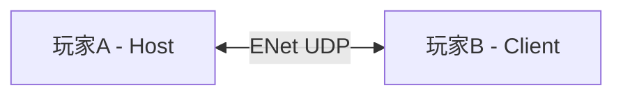
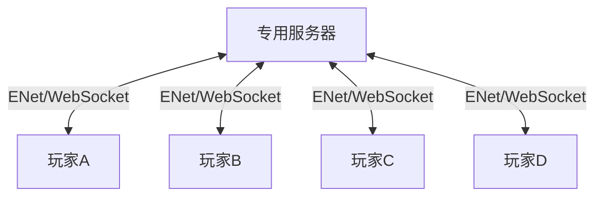
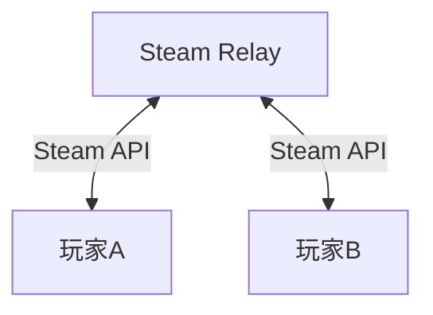
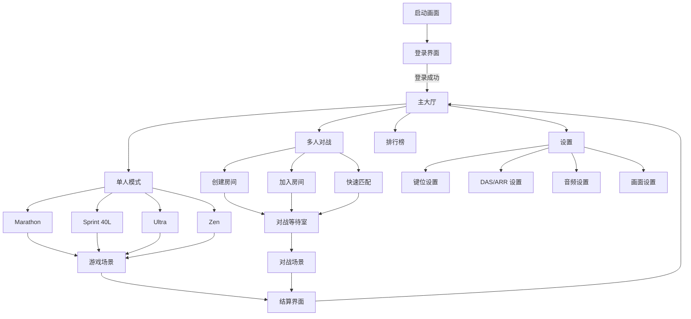
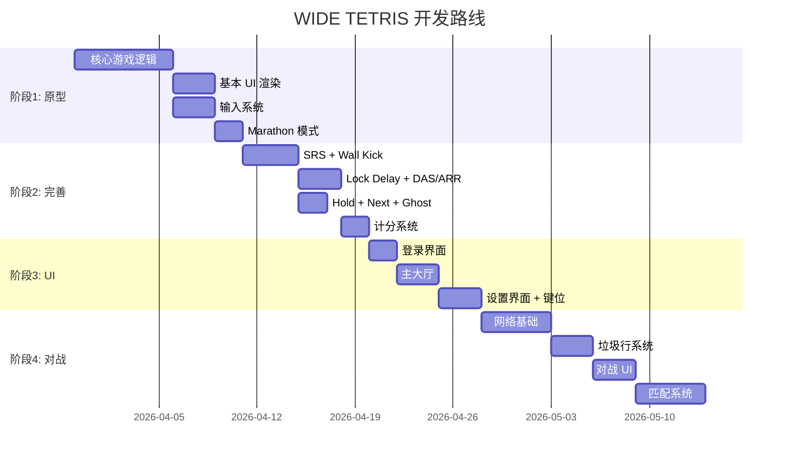

# WIDE TETRIS — 现代俄罗斯方块项目设计讨论

## 项目概览

基于 **Godot 4.6.1**（GDScript）开发的现代俄罗斯方块 PC 游戏。支持键盘/手柄输入、热键自定义、多种游戏模式、以及在线对战功能。

---

## 一、现代俄罗斯方块核心机制

以下是符合 **Tetris Guideline** 的现代俄罗斯方块必须实现的核心特性：

### 1.1 Super Rotation System (SRS) — 超级旋转系统

SRS 是现代俄罗斯方块的标准旋转系统，定义了所有 7 种方块（I, O, T, S, Z, J, L）的 4 个旋转状态和旋转行为。

| 方块 | 旋转中心 | 特殊说明 |
|------|---------|---------|
| I | 偏移中心，4×4 网格 | Wall Kick 数据独立于其他方块 |
| O | 固定，不旋转 | 无需 Wall Kick |
| T, S, Z, J, L | 3×3 网格中心 | 共享一套 Wall Kick 数据 |

**设计要点：**
- 每个方块需要存储 4 个旋转状态的坐标数据
- 旋转时以数学中心点为基准
- 必须实现 Wall Kick 偏移表

### 1.2 Wall Kick（墙踢）

当旋转被墙壁或已放置方块阻挡时，系统会尝试一系列预定义的偏移位置，让旋转仍然可以成功。

**SRS Wall Kick 测试顺序：**
- 每次旋转尝试 5 个位置（包括原始位置）
- I 方块有独立的偏移数据表
- 其他方块共享偏移数据表
- 这是实现 **T-Spin** 的关键机制

> [!IMPORTANT]
> Wall Kick 数据表是固定的标准数据，我们需要精确实现。这直接影响到 T-Spin 判定和高级玩法的可行性。

### 1.3 Lock Delay（锁定延迟）

方块接触地面/已放置方块后，**不会立即锁定**，而是进入锁定延迟阶段。

**机制细节：**
- **延迟时间**: 通常为 0.5 秒
- **Move Reset（移动重置）**: 玩家在锁定延迟期间移动或旋转方块，会重置锁定计时器
- **最大重置次数**: 为防止无限拖延，通常限制为 **15 次**重置
- **高度重置**: 如果方块下落到新的最低点，重置次数会被恢复

**实现方案：**
```
状态机:
  FALLING → 正常下落
  LOCKING → 接触地面，倒计时开始
    ↳ 玩家操作 → 重置计时器（计入重置次数）
    ↳ 计时器归零 → LOCKED（方块固定）
    ↳ 方块离开接触 → 回到 FALLING
```

### 1.4 Hold（暂存方块）

- 玩家可以随时将当前方块存入 Hold 槽位
- 如果 Hold 槽位已有方块，则交换
- **每次放置一个方块后才能再次使用 Hold**（防止无限交换）
- Hold 的方块会重置为初始旋转状态

### 1.5 7-Bag 随机系统

| 特性 | 说明 |
|------|------|
| 原理 | 每个"袋子"包含全部 7 种方块，随机排列后依次发放 |
| 公平性 | 最多 12 个方块间隔内必定出现任何特定方块 |
| 连续保证 | 不会出现同一方块连续 3 次的情况 |
| Next 预览 | 显示接下来的 5-6 个方块 |

### 1.6 Ghost Piece（幽灵方块）

在游戏区域底部显示当前方块的投影位置，帮助玩家精确放置。

### 1.7 其他关键特性

| 特性 | 说明 |
|------|------|
| **Hard Drop** | 立即将方块降落到最底部并锁定 |
| **Soft Drop** | 加速方块下落，但不立即锁定 |
| **DAS (Delayed Auto Shift)** | 长按左/右，在初始延迟后开始连续移动 |
| **ARR (Auto Repeat Rate)** | 连续移动时的重复速率 |
| **T-Spin 判定** | 基于 SRS Wall Kick 的 T 方块特殊旋转判定 |
| **Combo 系统** | 连续消行累计计数 |
| **Back-to-Back** | 连续进行困难消除（Tetris/T-Spin）的额外加分 |
| **Perfect Clear** | 清空整个游戏区域的特殊奖励 |

> [!TIP]
> DAS 和 ARR 参数应该对玩家可调，不同竞技水平的玩家偏好差异很大（竞技玩家通常使用极低的 ARR 值）。

---

## 二、多人对战系统

### 2.1 对战核心机制 — 垃圾行系统

对战的核心在于 **Garbage Lines（垃圾行）**：

| 消除类型 | 发送垃圾行数 |
|---------|-------------|
| Single | 0 |
| Double | 1 |
| Triple | 2 |
| Tetris (4行) | 4 |
| T-Spin Mini | 0 |
| T-Spin Single | 2 |
| T-Spin Double | 4 |
| T-Spin Triple | 6 |
| Perfect Clear | 10 |

**垃圾行队列系统：**
- 收到的垃圾行不会立即添加，而是进入 **垃圾行队列**
- 玩家可以通过自己消行来 **抵消** 队列中的垃圾行
- 未被抵消的垃圾行在玩家锁定下一个方块后从底部推入
- 垃圾行中有一个随机缺口（同一次攻击的垃圾行缺口位置相同）

**额外加成：**
- **Combo 加成**: 连续消行 +1, +1, +2, +2, +3, +3...
- **B2B 加成**: 连续困难消除额外 +1
- **All Spin Bonus**（可选）: 不仅 T-Spin，其他方块的 Spin 也给予奖励

### 2.2 网络架构方案对比

> [!IMPORTANT]
> 这是需要重点讨论的决策点，不同方案会显著影响开发复杂度和用户体验。

#### 方案 A：ENet P2P（主机-客户端模式）



| 维度 | 评估 |
|------|------|
| 开发复杂度 | ⭐⭐ 低 |
| 延迟 | ⭐⭐⭐⭐ 低延迟（直连） |
| 反作弊 | ⭐ 差（Host 可作弊） |
| 成本 | ⭐⭐⭐⭐⭐ 零服务器成本 |
| NAT 穿透 | ⭐⭐ 需要端口转发 |
| 适用场景 | 局域网对战 / 好友对战 |

**Godot 实现：**
```gdscript
# Host
var peer = ENetMultiplayerPeer.new()
peer.create_server(8910)
multiplayer.multiplayer_peer = peer

# Client
var peer = ENetMultiplayerPeer.new()
peer.create_client("192.168.x.x", 8910)
multiplayer.multiplayer_peer = peer
```

#### 方案 B：专用服务器（中心化）



| 维度 | 评估 |
|------|------|
| 开发复杂度 | ⭐⭐⭐⭐ 高 |
| 延迟 | ⭐⭐⭐ 中等（经过服务器中转） |
| 反作弊 | ⭐⭐⭐⭐⭐ 优秀（服务器验证） |
| 成本 | ⭐⭐ 需要服务器费用 |
| NAT 穿透 | ⭐⭐⭐⭐⭐ 无问题 |
| 适用场景 | 正式竞技 / 排位匹配 |

#### 方案 C：Steam Networking (GodotSteam)



| 维度 | 评估 |
|------|------|
| 开发复杂度 | ⭐⭐⭐ 中等 |
| 延迟 | ⭐⭐⭐⭐ 低（Steam 优化中继） |
| 反作弊 | ⭐⭐⭐ 中等 + Steam 生态 |
| 成本 | ⭐⭐⭐⭐ Steam 提供免费中继 |
| NAT 穿透 | ⭐⭐⭐⭐⭐ Steam 自动处理 |
| 适用场景 | Steam 发售 |

> [!WARNING]
> 方案 C 依赖 Steam 平台，如果要发售到其他平台需要额外方案。

#### 我的建议：混合方案

**推荐分阶段实现：**

1. **原型阶段**: 使用 **方案 A (ENet P2P)** 快速验证对战逻辑
2. **正式发布**: 根据发行平台选择
   - Steam 发售 → 加入 方案 C
   - 需要匹配系统/排位 → 加入 方案 B

> [!IMPORTANT]
> **需要你的决策**: 你是否计划在 Steam 上发售？这会影响我们优先实现哪种网络方案。

### 2.3 对战同步策略

俄罗斯方块对战的一个**关键优势**：每个玩家的游戏场景是独立的，只需要同步以下信息：

| 同步内容 | 频率 | 方向 |
|---------|------|------|
| 垃圾行攻击事件 | 事件驱动 | 双向 |
| 对手的棋盘状态快照 | 低频（用于显示对手画面） | 双向 |
| KO / 游戏结束 | 事件驱动 | 双向 |
| 消行/T-Spin 等事件 | 事件驱动（可选，用于 UI 特效） | 双向 |

这意味着：
- **不需要逐帧同步操作** — 大幅降低网络要求
- **每个客户端独立运行游戏逻辑** — 减少延迟影响
- **网络带宽需求极低** — 几百字节/秒足够

---

## 三、项目架构设计

### 3.1 场景树结构

```
Main (Node)
├── GameManager (Autoload/Singleton)
│   ├── 游戏状态管理
│   ├── 分数系统
│   └── 网络管理
├── InputManager (Autoload/Singleton)
│   ├── 输入映射
│   ├── 键位配置
│   └── 手柄支持
├── AudioManager (Autoload/Singleton)
│   ├── 音乐管理
│   └── 音效管理
├── UIManager
│   ├── LoginScreen (登录界面)
│   ├── MainLobby (主大厅)
│   ├── GameModeSelect (游戏模式选择)
│   ├── SettingsMenu (设置界面)
│   └── InGameUI (游戏内 UI)
└── GameScene (游戏场景)
    ├── Board (游戏区域)
    ├── CurrentPiece (当前方块)
    ├── GhostPiece (幽灵方块)
    ├── HoldDisplay (暂存方块显示)
    ├── NextQueue (下一个方块队列)
    └── OpponentView (对战时的对手画面)
```

### 3.2 核心模块划分

```
scripts/
├── core/                    # 核心游戏逻辑
│   ├── board.gd            # 游戏棋盘（10×20 + 隐藏行）
│   ├── piece.gd            # 方块基类
│   ├── piece_data.gd       # 7 种方块的形状/颜色/SRS 数据
│   ├── srs.gd              # SRS 旋转系统 + Wall Kick
│   ├── bag_randomizer.gd   # 7-Bag 随机生成器
│   ├── lock_delay.gd       # 锁定延迟系统
│   └── scoring.gd          # 计分与连击系统
├── game/                    # 游戏流程
│   ├── game_manager.gd     # 游戏状态管理
│   ├── single_player.gd    # 单人模式逻辑
│   ├── versus_mode.gd      # 对战模式逻辑
│   └── garbage_system.gd   # 垃圾行系统
├── input/                   # 输入系统
│   ├── input_manager.gd    # 输入管理
│   ├── key_config.gd       # 键位配置
│   └── das_arr.gd          # DAS/ARR 处理
├── network/                 # 网络模块
│   ├── network_manager.gd  # 网络连接管理
│   ├── lobby.gd            # 大厅/房间系统
│   └── sync.gd             # 同步逻辑
├── ui/                      # UI 相关
│   ├── login_screen.gd     # 登录界面
│   ├── main_lobby.gd       # 主大厅
│   ├── settings_menu.gd    # 设置界面
│   └── hud.gd              # 游戏内 HUD
└── data/                    # 数据定义
    ├── srs_data.gd         # SRS Wall Kick 偏移表
    ├── config.gd           # 游戏配置常量
    └── save_data.gd        # 存档系统
```

### 3.3 游戏模式

| 模式 | 说明 | 优先级 |
|------|------|--------|
| Marathon | 经典模式，持续游戏直到失败 | P0 - 原型必须 |
| Sprint (40L) | 尽快消除 40 行 | P1 |
| Ultra (限时) | 2 分钟内尽量得分 | P1 |
| VS 1v1 | 在线对战 | P1 |
| VS 多人 | 多人大乱斗（4人+） | P2 |
| Zen | 无压力练习模式 | P2 |

---

## 四、UI 流程设计



---

## 五、输入系统设计

### 5.1 默认键位映射

| 操作 | 键盘默认 | 手柄默认 |
|------|---------|---------|
| 左移 | ← / A | D-Pad 左 / 左摇杆左 |
| 右移 | → / D | D-Pad 右 / 左摇杆右 |
| 软降 | ↓ / S | D-Pad 下 / 左摇杆下 |
| 硬降 | Space | A / X |
| 顺时针旋转 | ↑ / X | B / Circle |
| 逆时针旋转 | Z | Y / Triangle |
| 180° 旋转 | A | LB |
| Hold | C / Shift | RB |
| 暂停 | Escape | Start |

### 5.2 DAS/ARR 参数

| 参数 | 默认值 | 范围 | 说明 |
|------|--------|------|------|
| DAS | 133ms | 50-300ms | 首次按下到开始重复移动的延迟 |
| ARR | 10ms | 0-100ms | 重复移动的间隔 |
| Soft Drop 速度 | 20x | 1-60x | 软降速度倍率 |

### 5.3 Godot 输入系统实现思路

- 使用 **InputMap** 定义全部操作
- 通过 **InputEvent** 支持键盘和手柄
- 自定义 DAS/ARR 在 `_process()` 中手动管理（不依赖 Godot 内置按键重复）
- 键位配置通过 `ConfigFile` 持久化

> [!NOTE]
> Godot 内置的按键重复依赖系统设置，不够精确。竞技俄罗斯方块需要自己实现 DAS/ARR 逻辑。

---

## 六、开放问题（需要讨论）

> [!IMPORTANT]
> 以下问题会显著影响架构和开发路线，请告诉我你的想法：
>
> ### Q1：登录系统
> - 是否需要服务器端账号系统？还是本地存档即可？
> - 如果需要账号系统，你倾向于哪种方案？
>   - Steam 账号集成
>   - 自建账号服务器
>   - 第三方服务（如 Firebase）
>
> ### Q2：对战模式发行平台
> - 是否计划在 Steam 上发行？
> - 是否需要跨平台对战？
>
> ### Q3：棋盘尺寸
> - 项目叫 "WIDE TETRIS"——你打算用标准 10 列宽还是更宽的棋盘？
> - 如果是宽棋盘，具体多少列？这会影响 SRS 数据和平衡性
>
> ### Q4：美术风格
> - 你有偏好的视觉风格吗？（像素风 / 现代极简 / 霓虹风 / 其他）
> - 方块是使用精灵图还是程序化绘制？
>
> ### Q5：原型阶段优先级
> - 你希望原型版本包含哪些最小特性？
> - 我建议的最小原型：
>   - [x] 10×20 标准棋盘 + 基本渲染
>   - [x] 7 种方块 + SRS 旋转 + Wall Kick
>   - [x] 7-Bag 随机
>   - [x] Hold + Next 预览
>   - [x] Lock Delay
>   - [x] Ghost Piece
>   - [x] Hard/Soft Drop
>   - [x] 基本计分
>   - [x] Marathon 模式
>   - [ ] 键位自定义（P1）
>   - [ ] 对战模式（P1）

---

## 七、如何利用文档进行长线协作

> [!TIP]
> 以下机制可以帮助我们在多次对话中保持上下文一致性。

### 7.1 知识项目 (Knowledge Items)
我可以在对话结束时将关键设计决策和技术细节保存为 **知识项目（KI）**。在后续对话中，我会自动检索这些知识来保持一致性。

**你可以让我保存的内容：**
- 架构决策和理由
- SRS 偏移数据表
- 键位配置格式
- 网络协议定义
- 编码规范和命名约定

### 7.2 工作流文件 (Workflows)
你可以创建 `.md` 工作流文件，定义常见操作的步骤：

**推荐创建的工作流：**
- `/build` — 构建和测试项目
- `/test` — 运行特定测试场景
- `/deploy` — 导出游戏
- `/review` — 代码审查流程

### 7.3 实现计划与任务追踪
每次开始新功能时，我会创建：
- `implementation_plan.md` — 详细设计文档
- `task.md` — 任务清单和进度追踪
- `walkthrough.md` — 完成后的变更总结

### 7.4 项目文档
建议在项目中维护以下文档：

```
docs/
├── DESIGN.md           # 总体设计文档（从本文档演化）
├── SRS_DATA.md         # SRS 偏移数据表
├── NETWORK_PROTOCOL.md # 网络协议定义
├── CONTROLS.md         # 输入系统文档
└── CHANGELOG.md        # 版本变更日志
```

### 7.5 最佳实践
1. **每次对话开始时**，你可以简单说明"继续 XX 功能开发"，我会自动查阅之前的知识
2. **做出重要决策后**，让我"把这个决策记录下来"
3. **遇到复杂问题时**，可以让我"先研究一下 XX 的最佳实践"
4. **使用 `/chinese` 工作流** 确保我始终用中文回复

---

## 八、建议的开发路线



---

## 验证计划

### 原型阶段验证
- 在 Godot 编辑器中直接运行游戏场景
- 验证所有 7 种方块的旋转状态正确
- 验证 Wall Kick 在边界和复杂堆叠情况下的行为
- 验证 Lock Delay 计时器和重置机制
- 验证 7-Bag 随机器的公平性

### 对战阶段验证
- 本机双实例测试（两个 Godot 实例连接）
- 垃圾行发送/接收/抵消逻辑
- 网络延迟模拟测试